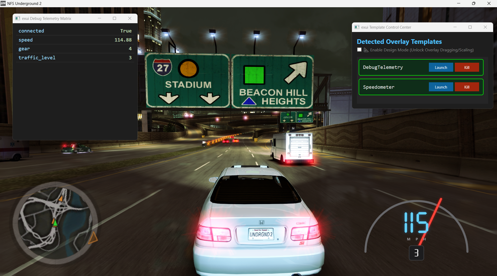

# exui-api
simple memory scanner & socket server for nfsu2

**under progress. not ready for casual usage. Proof of Concept**

### requirements
- .net sdk 10 LTS
## What it does
with simple configuration in the `variables.txt`:
```
speed,float,speed2.exe+3F09E8
gear,int,speed2.exe+4659BC->1E4
traffic_level,byte,speed2.exe+43AB7C
```

the project attaches itself to the nfsu2 memory and retrieves the relevant data and serves them in:
```
[exui] HTTP debug endpoint active: http://localhost:8080/exui
[exui] WebSocket live stream active: ws://localhost:8080/exui
```

this project is meant to be the backend of [exui-wpf]() 

